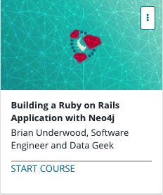

```
Roberto Nogueira  
BSd EE, MSd CE
Solution Integrator Experienced - Certified by Ericsson
```
# Udemy Building a Ruby on Rails Application with Neo4j



**About **

Learn everything you need to about the subject of this `Udemy` project.

[Homepage](https://www.udemy.com/course/building-a-ruby-on-rails-application-with-neo4j/)

## Topics
```
[x] 0. Introduction 01:20
[ ] 1. Creating a Rails app 04:22
[ ] 2. ActiveNode Properties 03:13
[ ] 3. Associations 04:52
[ ] 4. Association Chaining 06:11
[ ] 5. ActiveRel ActiveRel 05:23
[ ] 6. Deeper Querying 06:10
```
